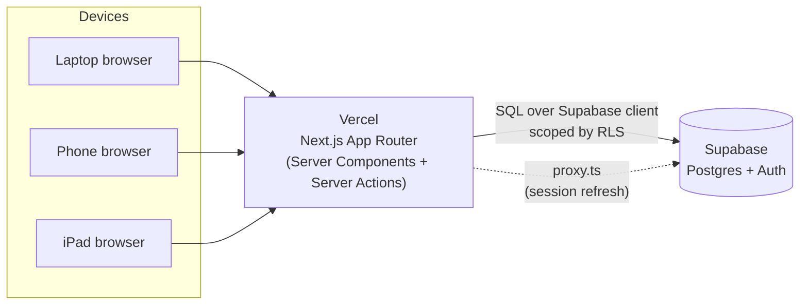
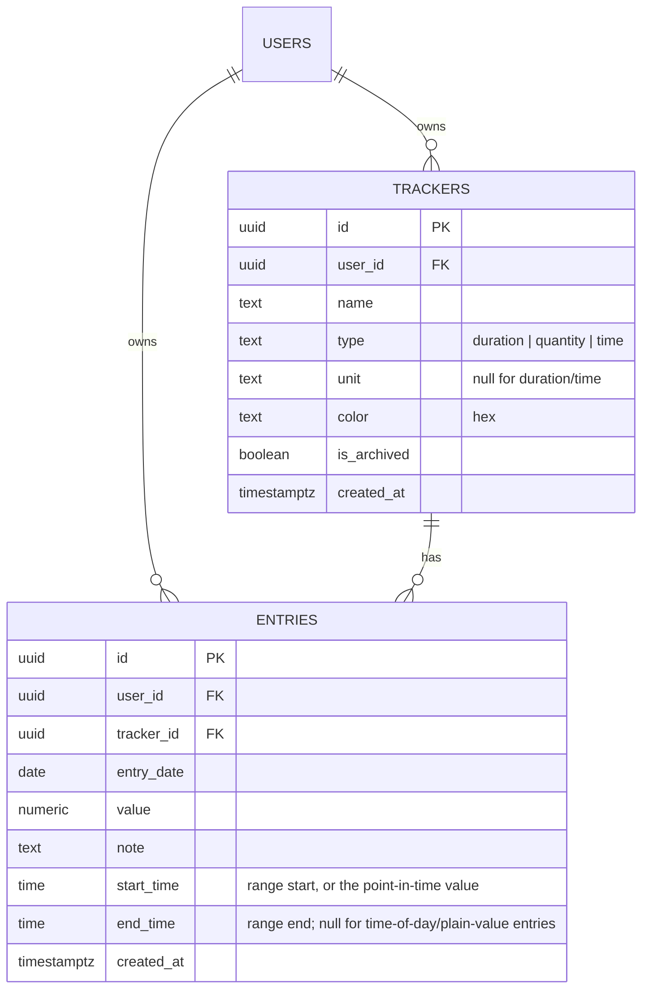
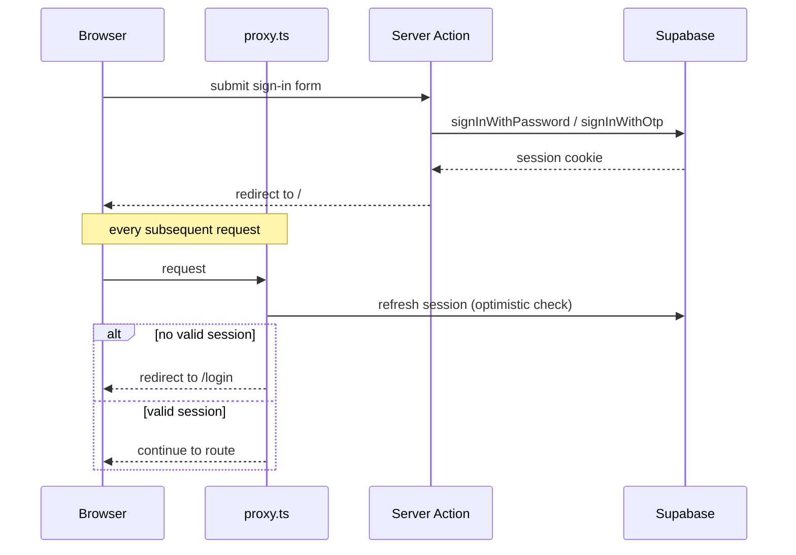
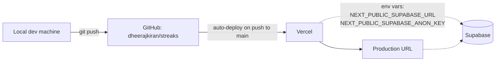

# Architecture

How Streaks is put together, and why.

## Overview

Streaks is a Next.js App Router app backed by Supabase (Postgres + Auth), deployed on Vercel. There is no separate backend service — Server Components and Server Actions talk to Supabase directly, and Supabase's row-level security (RLS) is the actual authorization boundary, not application code.



Why this shape:

- **No custom API layer.** Server Components query Supabase directly at render time; Server Actions (`"use server"` functions) handle every mutation (create/update/delete a tracker, log/delete an entry). This keeps the app to a single deployable unit.
- **RLS as the security boundary.** Every table policy checks `auth.uid() = user_id`. Even if a bug in a Server Component or Action forgot to filter by user, the database itself would refuse to return or modify another user's rows.
- **Supabase for both data and auth.** One provider for the Postgres database, session management, and email (magic-link) delivery, instead of stitching together separate services.

## Directory structure

```
src/
  app/
    (dashboard)/
      layout.tsx          # auth guard + nav, wraps all authenticated routes
      page.tsx             # main dashboard: quick-add, timeline, heatmap, entry log, today panel
      trackers/page.tsx    # tracker management (create, edit, archive, delete)
    actions/
      auth.ts               # sign-in (password + magic link), sign-out
      trackers.ts           # create/update/archive/delete tracker
      entries.ts             # create/delete entry
    auth/confirm/route.ts  # magic-link callback (PKCE code exchange)
    login/page.tsx          # sign-in page (password / magic-link toggle)
    layout.tsx               # root layout, fonts, metadata
  components/                # presentational + form components (see below)
  lib/
    supabase/
      client.ts               # browser Supabase client
      server.ts                # server Supabase client (Server Components/Actions)
      session.ts               # session-refresh logic used by proxy.ts
    types.ts                    # Tracker, Entry, TrackerType
    colors.ts                    # shared categorical color palette
    heatmap.ts, timeline.ts       # chart math (bucketing, date grids, time parsing)
  proxy.ts                        # Next.js 16's renamed middleware: refreshes the
                                    # Supabase session cookie and redirects unauthenticated
                                    # requests to /login (optimistic check only — RLS is
                                    # the real gate, per Next.js's own auth guidance)
supabase/migrations/               # SQL schema, applied by hand in the Supabase SQL editor
```

Key components:

| Component | Role |
|---|---|
| `Heatmap` | GitHub-style month grid for one tracker, color intensity by daily total |
| `DayTimeline` | 12 AM–11:59 PM view of today, one colored block per timed entry |
| `TodayPanel` | Today's totals: hero number, per-tracker bars, stat tiles |
| `EntryLog` | List of individual logged entries (time, value, note), deletable |
| `QuickAddEntry` | Logging form; shape adapts to the tracker's type (value / start–end / time) |
| `TrackerForm` / `TrackerRow` | Create a tracker / inline-edit an existing one |

## Data model

Two tables, both owned by `auth.users` (Supabase's built-in user table) and protected by RLS.



Notes on the design:

- **Multiple entries per tracker per day are expected**, not an edge case — logging "worked 1h, took a break, worked another 2h" is three separate `entries` rows for the same `tracker_id`/`entry_date`. The heatmap and Today panel both sum `value` grouped by day/tracker rather than assuming one row per day.
- **`value` is always a plain number**, but what it means depends on the tracker's `type`:
  - `duration` → minutes
  - `quantity` → whatever unit the tracker defines
  - `time` → minutes since midnight (so the heatmap's daily-total math and color bucketing still work generically for this type too, and the exact clock time round-trips cleanly from it)
- **`start_time`/`end_time`** are optional and reused across two features: a `duration` entry logged as a start–end range populates both; a `time`-type entry (wake-up time, etc.) populates only `start_time`.
- **Archiving vs. deleting a tracker**: archiving sets `is_archived` and hides it from the quick-add picker, but keeps all historical entries and heatmap data intact. Deleting cascades and removes the entries too (`on delete cascade`).

## Auth flow

Two sign-in paths, both provided by Supabase Auth:

1. **Magic link** — `signInWithOtp` sends an email; the link redirects to `/auth/confirm?code=...` (Supabase's PKCE flow), which calls `exchangeCodeForSession` and redirects to `/`. The route also handles the older `token_hash`/`type` OTP format as a fallback.
2. **Password** — `signInWithPassword`, for reliable day-to-day access without depending on email delivery (Supabase's free-tier email sender is rate-limited).



`proxy.ts` (Next.js 16 renamed `middleware.ts` to `proxy.ts`) only performs an *optimistic* check — it reads the session cookie and redirects if it looks invalid, but every actual data query is still scoped by RLS server-side. That split follows Next.js's own auth guidance: proxy/middleware is for cheap, fast redirects; the database is the real gate.

## Request flow: logging an entry

1. `QuickAddEntry` (client component) renders a form whose shape depends on the selected tracker's `type` — a plain value, a start/end time range, or a single time.
2. On submit, the `createEntry` Server Action validates the payload, computes `value` (parsing a time range into minutes if needed), and inserts a row via the server Supabase client.
3. The action calls `revalidatePath("/")`, which invalidates the dashboard's cached Server Component render.
4. On the next render, the heatmap, Today panel, timeline, and entry log all re-query Supabase and reflect the new entry — there's no separate client-side cache to keep in sync.

## Deployment pipeline



- Source of truth is the `main` branch on GitHub; there's no separate staging environment.
- Vercel's GitHub integration builds and deploys automatically on every push to `main`.
- Supabase is a separate managed service — schema changes are applied by hand (SQL editor) rather than through Vercel's deploy pipeline, since there's no CI step running migrations automatically.

## Migrations

Applied in order, by hand, in the Supabase SQL editor:

| File | What it does |
|---|---|
| `0001_init.sql` | Creates `trackers` and `entries`, enables RLS, adds the four CRUD policies per table |
| `0002_entry_time_range.sql` | Adds `start_time`/`end_time` to `entries`, for duration entries logged as a range |
| `0003_time_of_day_tracker.sql` | Adds `'time'` to the tracker `type` check constraint; loosens the entry `value` check to `>= 0` (a time-of-day entry at exactly midnight is valid) |

## Design decisions worth knowing

- **No custom API routes for CRUD.** Server Actions are used instead of `app/api/*` route handlers, since every mutation here originates from a form on the same app — there's no external API consumer to design around.
- **Categorical color palette is CVD-validated**, not picked by eye — see `src/lib/colors.ts`. Chosen to stay legible for colorblind readers across the heatmap, timeline, and Today panel, which all key tracker identity by color.
- **Client-vs-server component split favors server rendering.** Only components that need interactivity (forms, toggles, the tracker edit row) are Client Components; charts and lists are Server Components that re-fetch on every navigation/revalidation rather than holding client-side state.
